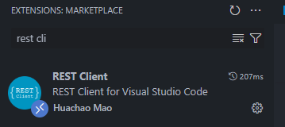
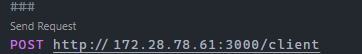

## Projeto molde-transaction

Este projeto foi inicializado para adicionar padrão separando camadas e suas responsabilidades ultilizando:
- boas praticas
- padrões de projeto 
- design de projeto e código

O modelo para iniciar este projeto se encontra em
[molde-transaction](https://github.com/EvertonLMsilva/molde-transaction)

### Setup do projeto

Neste projeto foi adicionado um container para banco de dados com postgres.

#### Montando container.
Na pasta raiz do projeto, abra seu terminal e rode este comando.

```
docker-composer up -d
```

Você pode usar o PgAdmin para monitorar seu banco de dados.

## Banco de dados

Ao montar o container deverá conter em seu banco de dados os seguintes parametros.

#### Schema
- transactions_bank

#### Tables
- clients
- accounts
- transactions

### Iniciando projeto

Para iniciar o projeto execulte o seguinte comando.

#### NPM
```
npm install
npm run dev
```

#### YARN
```
yarn i
yarn dev
```

#### PNPM (recomendado)
```
pnpm install
pnpm dev
```

### API
Uma maneira para consultar as api sem precisar do postman ou outro software para execultar as request é com a extensão "REST CLIENT"



Após instalar, no projeto tem o arquivo .http que ja tem as rotas com os bodys, basta clicar no "send request" como na imagem abaixo.

